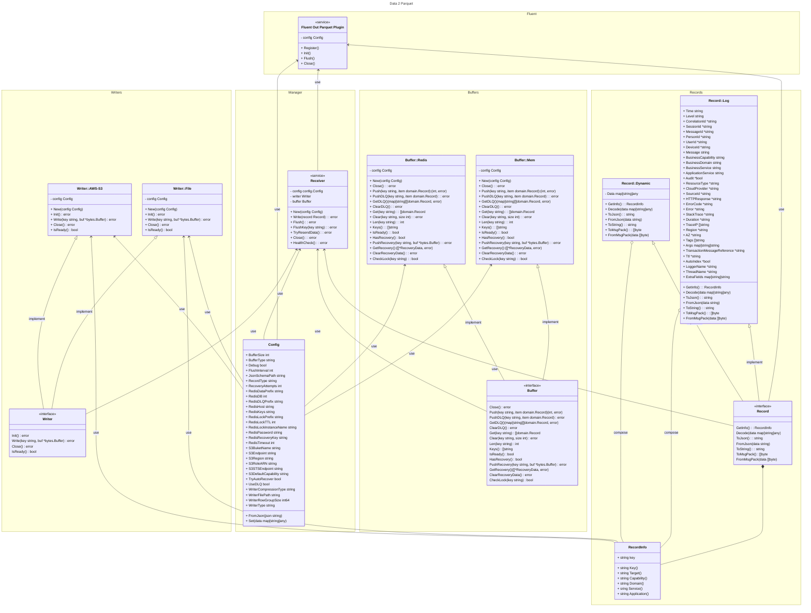

# Data2Parquet-go
A go data converter to Apache Parquet

## Concepts
We need to receive a large amount of json data and create structured parquet files. Considering that we will receive data line by line and it will be necessary to create a buffer to obtain better performance from the files. To do this, we will use a kind of buffer to temporarily store this data and we will create an asynchronous process, triggered by this buffer size or with a time interval.

## Flows

### Receiving data (Redis example)


### Flush process (Redis example)


## Components



## Applications (/cmd)
### [Data Generator](https://github.com/RafaelFino/Data2Parquet-go/blob/main/cmd/data-generator/main.go)
Simple data creator to simulate workloads to json2parquet.
### [Json2Parquet](https://github.com/RafaelFino/Data2Parquet-go/blob/main/cmd/json2parquet/main.go)
Worker that can receive a file with json data (records - log), process and create parquet files splited with keys.
### [Http Server](https://github.com/RafaelFino/Data2Parquet-go/blob/main/cmd/http-server/main.go)
A HTTP-Server that offer a HTTP Rest API to send data and manage Flush process.
### [FluentBit Parquet Output Plugin](https://github.com/RafaelFino/Data2Parquet-go/blob/main/cmd/fluent-out-parquet/main.go)
A shared object built to works with FluentBit as an Output plugin.

### The [Record Type](https://github.com/RafaelFino/Data2Parquet-go/blob/main/pkg/domain/record.go) (/pkg/domain)
``` golang
type Log struct {
	ApplicationService          string            `json:"application-service" parquet:"name=application-service, type=BYTE_ARRAY, convertedtype=UTF8, encoding=PLAIN_DICTIONARY" msg:"application-service"`
	Args                        map[string]string `json:"args,omitempty" parquet:"name=args, type=MAP, convertedtype=MAP, keytype=BYTE_ARRAY, keyconvertedtype=UTF8, valuetype=BYTE_ARRAY" msg:"args"`
	Audit                       *bool             `json:"audit,omitempty" parquet:"name=audit, type=BOOLEAN" msg:"audit"`
	AutoIndex                   *bool             `json:"auto-index,omitempty" parquet:"name=auto-index, type=BOOLEAN" msg:"auto-index"`
	AZ                          *string           `json:"az,omitempty" parquet:"name=az, type=BYTE_ARRAY, convertedtype=UTF8, encoding=PLAIN_DICTIONARY" msg:"az"`
	BusinessCapability          string            `json:"business-capability" parquet:"name=business-capability, type=BYTE_ARRAY, convertedtype=UTF8, encoding=PLAIN_DICTIONARY" msg:"business-capability"`
	BusinessDomain              string            `json:"business-domain" parquet:"name=business-domain, type=BYTE_ARRAY, convertedtype=UTF8, encoding=PLAIN_DICTIONARY" msg:"business-domain"`
	BusinessService             string            `json:"business-service" parquet:"name=business-service, type=BYTE_ARRAY, convertedtype=UTF8, encoding=PLAIN_DICTIONARY" msg:"business-service"`
	CloudProvider               *string           `json:"cloud-provider" parquet:"name=cloud-provider, type=BYTE_ARRAY, convertedtype=UTF8, encoding=PLAIN_DICTIONARY" msg:"cloud-provider"`
	CorrelationId               *string           `json:"correlation-id,omitempty" parquet:"name=correlation-id, type=BYTE_ARRAY, convertedtype=UTF8, encoding=PLAIN_DICTIONARY" msg:"correlation-id"`
	DeviceId                    *string           `json:"device-id,omitempty" parquet:"name=device-id, type=BYTE_ARRAY, convertedtype=UTF8, encoding=PLAIN_DICTIONARY" msg:"device-id"`
	Duration                    *string           `json:"duration,omitempty" parquet:"name=duration, type=BYTE_ARRAY, convertedtype=UTF8, encoding=PLAIN_DICTIONARY" msg:"duration"`
	Error                       *string           `json:"error,omitempty" parquet:"name=error, type=BYTE_ARRAY, convertedtype=UTF8, encoding=PLAIN_DICTIONARY" msg:"error"`
	ErrorCode                   *string           `json:"error-code,omitempty" parquet:"name=error-code, type=BYTE_ARRAY, convertedtype=UTF8, encoding=PLAIN_DICTIONARY" msg:"error-code"`
	ExtraFields                 map[string]string `json:"extra-fields,omitempty" parquet:"name=extra-fields, type=MAP, convertedtype=MAP, keytype=BYTE_ARRAY, keyconvertedtype=UTF8, valuetype=BYTE_ARRAY" msg:"extra-fields"`
	HMAC                        string            `parquet:"name=hmac, type=BYTE_ARRAY, convertedtype=UTF8, encoding=PLAIN_DICTIONARY"`
	HTTPResponse                *string           `json:"http-response,omitempty" parquet:"name=http-response, type=BYTE_ARRAY, convertedtype=UTF8, encoding=PLAIN_DICTIONARY" msg:"http-response"`
	Level                       string            `json:"level" parquet:"name=level, type=BYTE_ARRAY, convertedtype=UTF8, encoding=PLAIN_DICTIONARY" msg:"level"`
	LoggerName                  *string           `json:"logger-name,omitempty" parquet:"name=logger-name, type=BYTE_ARRAY, convertedtype=UTF8, encoding=PLAIN_DICTIONARY" msg:"logger-name"`
	Message                     string            `json:"message" parquet:"name=message, type=BYTE_ARRAY, convertedtype=UTF8, encoding=PLAIN_DICTIONARY" msg:"message"`
	MessageId                   *string           `json:"message-id,omitempty" parquet:"name=message-id, type=BYTE_ARRAY, convertedtype=UTF8, encoding=PLAIN_DICTIONARY" msg:"message-id"`
	PersonId                    *string           `json:"person-id,omitempty" parquet:"name=person-id, type=BYTE_ARRAY, convertedtype=UTF8, encoding=PLAIN_DICTIONARY" msg:"person-id"`
	Region                      *string           `json:"region,omitempty" parquet:"name=region, type=BYTE_ARRAY, convertedtype=UTF8, encoding=PLAIN_DICTIONARY" msg:"region"`
	ResourceType                *string           `json:"resource-type" parquet:"name=resource-type, type=BYTE_ARRAY, convertedtype=UTF8, encoding=PLAIN_DICTIONARY" msg:"resource-type"`
	SessionId                   *string           `json:"session-id,omitempty" parquet:"name=session-id, type=BYTE_ARRAY, convertedtype=UTF8, encoding=PLAIN_DICTIONARY" msg:"session-id"`
	SourceId                    *string           `json:"source-id,omitempty" parquet:"name=source-id, type=BYTE_ARRAY, convertedtype=UTF8, encoding=PLAIN_DICTIONARY" msg:"source-id"`
	StackTrace                  *string           `json:"stack-trace,omitempty" parquet:"name=stack-trace, type=BYTE_ARRAY, convertedtype=UTF8, encoding=PLAIN_DICTIONARY" msg:"stack-trace"`
	Tags                        []string          `json:"tags,omitempty" parquet:"name=tags, type=MAP, convertedtype=LIST, valuetype=BYTE_ARRAY, valueconvertedtype=UTF8" msg:"tags"`
	ThreadName                  *string           `json:"thread-name,omitempty" parquet:"name=thread-name, type=BYTE_ARRAY, convertedtype=UTF8, encoding=PLAIN_DICTIONARY" msg:"thread-name"`
	Time                        string            `json:"time" parquet:"name=time, type=BYTE_ARRAY, convertedtype=UTF8, encoding=PLAIN_DICTIONARY" msg:"time"`
	TraceIP                     []string          `json:"trace-ip,omitempty" parquet:"name=trace-ip, type=MAP, convertedtype=LIST, valuetype=BYTE_ARRAY, valueconvertedtype=UTF8" msg:"trace-ip"`
	TransactionMessageReference *string           `json:"transaction-message-reference,omitempty" parquet:"name=transaction-message-reference, type=BYTE_ARRAY, convertedtype=UTF8, encoding=PLAIN_DICTIONARY" msg:"transaction-message-reference"`
	Ttl                         *string           `json:"ttl,omitempty" parquet:"name=ttl, type=BYTE_ARRAY, convertedtype=UTF8, encoding=PLAIN_DICTIONARY" msg:"ttl"`
	UserId                      *string           `json:"user-id,omitempty" parquet:"name=user-id, type=BYTE_ARRAY, convertedtype=UTF8, encoding=PLAIN_DICTIONARY" msg:"user-id"`	
}
```

## [Buffers](https://github.com/RafaelFino/Data2Parquet-go/blob/main/pkg/buffer/buffer.go) (/pkg/buffer)
Using the key `BufferType` you can choose the storage to make data buffer, before writer work. You can configure `BufferSize` and `FlushInterval` to manage data.
### [Mem](https://github.com/RafaelFino/Data2Parquet-go/blob/main/pkg/buffer/mem.go) (`BufferType` = `mem`)
Use a local memory structure to stora temporaly data before Writer receive data. This option should be more faster, but doesn't offer resilience in disaster case.
### [Redis](https://github.com/RafaelFino/Data2Parquet-go/blob/main/pkg/buffer/redis.go) (`BufferType` = `redis`)
Use a redis instance to store temporaly data before Writer receive data. This offer a more secure way to store buffer data, but requires an external resource (Redis).

Some parameters can be changed to handle Redis keys, such as `RedisKeys` and `RedisDataPrefix`, they will change how Writer make store keys.

The Works also can be configure just to receive data and never flush it, it is specialy important if you want to have more than one worker receiving data in a cluster, scanling worloads. It's very recommended that only one instance made Flush for each kind of key. To do that, use `RedisSkipFlush` key as `true`

## [Receiver](https://github.com/RafaelFino/Data2Parquet-go/blob/main/pkg/receiver/receiver.go) (/pkg/receiver)
This is the core for this service, responsable for receive data, buffering, enconde, decode and handle pages to Writers

## [Writers](https://github.com/RafaelFino/Data2Parquet-go/blob/main/pkg/writer/writer.go) (/pkg/writer)
Using the key `WriterType` you can choose the writer to write parquet data.
### [File](https://github.com/RafaelFino/Data2Parquet-go/blob/main/pkg/writer/file.go) (`WriterType` = `file`)
Write data in a local file, use the tag `WriterFilePath` to choose path to store data
### [AWS-S3](https://github.com/RafaelFino/Data2Parquet-go/blob/main/pkg/writer/aws-s3.go) (`WriterType` = `aws-s3`)

## [Config](https://github.com/RafaelFino/Data2Parquet-go/blob/main/pkg/config/config.go) (/pkg/config)
- **BufferSize**: BufferSize configuration tag, describe the size of the buffer, its an important field for control buffer and page size to flush data. The default value is `100`.
- **BufferType**: BufferType configuration tag, describe the type of the buffer, this fields accepte two values, `mem` or `redis`. The default value is `mem`.
- **Debug**: Debug configuration tag, describe the debug mode, its an optional field. The debug mode will generate a lot of information. The default value is `false`.
- **DisableLogColors**: DisableLogColors configuration tag, describe the disable log colors mode, its an optional field. The default value is `false`.
- **FlushInterval**: FlushInterval configuration tag, describe the interval to flush data in seconds, its an important field to control the time to flush data. The default value is `5`.
- **JsonSchemaPath**: JsonSchemaPath configuration tag, describe the path to the JSON schema file, its an optional field. The default value is empty. *This feature is not implemented yet.
- **RecordType**: RecordType configuration tag, describe the type of the record, this fields accepte two values, `log` or `dynamic`. The default value is log. *Dynamic type is not implemented yet.
- **RecoveryAttempts**: RecoveryAttempts configuration tag, describe the number of attempts to recover data, its an optional field. The default value is `0`.
- **RedisDataPrefix**: RedisDataPrefix configuration tag, describe the prefix of the data key in Redis, its an optional field. The default value is `data`.
- **RedisDB**: RedisDB configuration tag, describe the database number in Redis, its an optional field. The default value is `0`.
- **RedisHost**: RedisHost configuration tag, describe the host of the Redis server, its an optional field if you use `BufferType` as `mem`, but became required if `BufferType` is `redis`. The default value is empty but need to be set if `BufferType` is `redis`.
- **RedisKeys**: RedisKeys configuration tag, describe the keys of the Redis server, its an optional field. The default value is `keys`.
- **RedisLockPrefix**: RedisLockPrefix configuration tag, describe the prefix of the lock key in Redis, its an optional field. The default value is `lock`.
- **RedisPassword**: RedisPassword configuration tag, describe the password of the Redis server, its an optional field. The default value is empty.
- **RedisRecoveryKey**: RedisRecoveryKey configuration tag, describe the recovery key in Redis, its an optional field. The default value is `recovery`.
- **RedisDLQPrefix**: RedisDLQPrefix configuration tag, describe the prefix of the DLQ key in Redis, its an optional field. The default value is `dlq`.
- **RedisLockTTL**: RedisLockTTL configuration tag, describe the TTL of the lock key in Redis, its an optional field. The default value is `1.5x` 'FlushInterval` value.
- **RedisLockInstanceName**: RedisLockInstanceName configuration tag, describe the instance name of the lock key in Redis, its an optional field. The default value is empty and in this case, instance hostname will be considered.
- **RedisTimeout**: RedisTimeout configuration tag, describe the timeout of the Redis server, its an optional field. The default value is empty, in this case, `0` will be the value (Redis defaults).
- **S3BucketName**: S3BucketName configuration tag, describe the bucket name in S3, its an optional field. The default value is empty but need to be set if you use `aws-s3` as a writer.
- **S3Region**: S3Region configuration tag, describe the region of the S3 server, its an optional field. The default value is empty but need to be set if you use `aws-s3` as a writer.
- **S3RoleARN**: S3RoleARN configuration tag, describe the role name of the S3 server, its an optional field. The default value is empty but need to be set if you use `aws-s3` as a writer.
- **S3STSEndpoint**: S3STSEndpoint configuration tag, describe the endpoint of the STS server, its an optional field. The default value is empty but need to be set if you use `aws-s3` as a writer.
- **S3Endpoint**: S3Endpoint configuration tag, describe the endpoint of the S3 server, its an optional field. The default value is empty but need to be set if you use `aws-s3` as a writer.
- **TryAutoRecover**: TryAutoRecover configuration tag, describe the auto recover mode, its an optional field. The default value is `false`. If set to `true` the system will try to recover the data that failed to write after flash, using recovery cache.
- **UseDLQ**: UseDLQ configuration tag, describe the use of DLQ, its an optional field. The default value is `false`. If set to `true` the system will use the DLQ to store the data that failed to write after flash.
- **UseHash**: UseHash configuration tag, describe the use of hash, its an optional field. The default value is `false`. If set to `true` the system will use the hash to store the data in the buffer.
- **UseHMAC**: UseHMAC configuration tag, describe the use of HMAC, its an optional field. The default value is `false`. If set to `true` the system will use the HMAC to sign the data.
- **WriterCompressionType**: WriterCompressionType configuration tag, describe the compression type of the writer, its an optional field. The default and recommended value is `snappy`. This fields accepte two values, `snappy`, `gzip` or `none`.
- **WriterFilePath**: WriterFilePath configuration tag, describe the file path of the writer, its an optional field. The default value is `./out`.
- **WriterRowGroupSize**: WriterRowGroupSize configuration tag, describe the row group size of the writer, its an optional field. The default value is `134217728` (128M).
- **WriterType**: WriterType configuration tag, describe the type of the writer, this fields accepte two values, `file` or `aws-s3`. The default value is `file`.

``` golang
type Config struct {
	BufferSize            int    `json:"buffer_size"`
	BufferType            string `json:"buffer_type"`
	Debug                 bool   `json:"debug,omitempty"`
	FlushInterval         int    `json:"flush_interval"`
	JsonSchemaPath        string `json:"json_schema_path,omitempty"`
	RecordType            string `json:"record_type"`
	RecoveryAttempts      int    `json:"recovery_attempts,omitempty"`
	RedisDataPrefix       string `json:"redis_data_prefix,omitempty"`
	RedisDB               int    `json:"redis_db,omitempty"`
	RedisDLQPrefix        string `json:"redis_dlq_prefix,omitempty"`
	RedisHost             string `json:"redis_host,omitempty"`
	RedisKeys             string `json:"redis_keys,omitempty"`
	RedisLockPrefix       string `json:"redis_lock_prefix,omitempty"`
	RedisLockTTL          int    `json:"redis_lock_ttl,omitempty"`
	RedisLockInstanceName string `json:"redis_lock_instance_name,omitempty"`
	RedisPassword         string `json:"redis_password,omitempty"`
	RedisRecoveryKey      string `json:"redis_recovery_key,omitempty"`
	RedisTimeout          int    `json:"redis_timeout,omitempty"`
	S3BuketName           string `json:"s3_bucket_name"`
	S3Endpoint            string `json:"s3_endpoint,omitempty"`
	S3Region              string `json:"s3_region"`
	S3RoleARN             string `json:"s3_role_arn,omitempty"`
	S3STSEndpoint         string `json:"s3_sts_endpoint,omitempty"`
	S3DefaultCapability   string `json:"s3_default_capability,omitempty"`
	TryAutoRecover        bool   `json:"try_auto_recover,omitempty"`
	UseDLQ                bool   `json:"use_dlq,omitempty"`
	WriterCompressionType string `json:"writer_compression_type,omitempty"`
	WriterFilePath        string `json:"writer_file_path,omitempty"`
	WriterRowGroupSize    int64  `json:"writer_row_group_size,omitempty"`
	WriterType            string `json:"writer_type"`
	UseHash               bool   `json:"use_hash,omitempty"`
	UseHMAC               bool   `json:"use_hmac,omitempty"`
	DisableLogColors      bool   `json:"disable_log_colors,omitempty"`
}
```

#### Example to json2Parquet with Redis buffer and file writer:

``` json
{
    "buffer_size": 1000,
    "buffer_type": "redis",
    "debug": false,
    "flush_interval": 60,
    "log_path": "./logs",
    "redis_data_prefix": "data",
    "redis_db": 0,
    "redis_host": "0.0.0.0:6379",
    "redis_keys": "keys",
    "redis_password": "",
    "redis_skip_flush": false,
    "writer_compression_type": "snappy",
    "writer_file_path": "./data",
    "writer_row_group_size": 134217728,
    "writer_type": "file"
}
```

#### Example to json2Parquet with memory buffer and file writer:

``` json
{
    "buffer_type": "mem",
    "flush_interval": 60,
    "writer_compression_type": "snappy",
    "writer_file_path": "./data",
    "writer_row_group_size": 134217728,
    "writer_type": "file"
}
```

#### Fluent Out Parquet config keys
To FluentBit, use the main key name, example: `WriterType` instead `writer_type`

##### Fluent output config example
``` ini
[OUTPUT]
  Name  out_parquet
  Match *
  BufferSize 1000
  FlushInterval 12
  BufferType redis
  Debug true
  UseDLQ false
  WriterFilePath /home/fino/git/Data2Parquet-go/data
  WriterType aws-s3
  S3BucketName data2parquet
  S3Region us-east-2
  S3RoleARN arn:aws:iam::localstack:role/localhost:4566
  S3STSEndpoint http://localhost:4566
  S3Endpoint http://localhost:4566
```

##### Keys to Fluent-Bit Output
``` golang
var keys = []string{
	"BufferSize",
	"BufferType",
	"Debug",
	"DisableLogColors",
	"FlushInterval",
	"JsonSchemaPath",
	"RecordType",
	"RecoveryAttempts",
	"RedisDataPrefix",
	"RedisDB",
	"RedisHost",
	"RedisKeys",
	"RedisLockInstanceName",
	"RedisLockPrefix",
	"RedisLockTTL",
	"RedisPassword",
	"RedisRecoveryKey",
	"RedisSQLPrefix",
	"RedisTimeout",
	"S3BucketName",
	"S3DefaultCapability",
	"S3Endpoint",
	"S3Region",
	"S3RoleARN",
	"S3STSEndpoint",
	"TryAutoRecover",
	"UseDLQ",
	"UseHash",
	"UseHMAC",
	"WriterCompressionType",
	"WriterFilePath",
	"WriterRowGroupSize",
	"WriterType",
}
```

## Build instructions
### Building amd64 running on an arm64 Processor (mac Mx, raspberry, etc)
``` shell
docker run -it -v ./:/go/src golang:1.20 bash
# inside container
dpkg --add-architecture amd64 
apt-get udate
apt-get install libjpeg-dev:amd64
apt-get install g++-x86-64-linux-gnu libc6-dev-amd64-cross

os="linux"
arch="amd64"

echo ">> Building for $os $arch"
echo ">>   [$os $arch] Building http-server -> ./bin/$os-$arch/http-server"
GOOS=$os GOARCH=$arch CGO_ENABLED=1 CC=x86_64-linux-gnu-gcc go build -ldflags="-s -w" -o bin/$os-$arch/http-server -ldflags="-s -w" -trimpath cmd/http-server/main.go

echo ">>   [$os $arch] Building json2parquet -> ./bin/$os-$arch/json2parquet"
GOOS=$os GOARCH=$arch CGO_ENABLED=1 CC=x86_64-linux-gnu-gcc go build -ldflags="-s -w" -o bin/$os-$arch/json2parquet -ldflags="-s -w" -trimpath cmd/json2parquet/main.go

echo ">>   [$os $arch] Building data-generator -> ./bin/$os-$arch/data-generator"
GOOS=$os GOARCH=$arch CGO_ENABLED=1 CC=x86_64-linux-gnu-gcc go build -ldflags="-s -w" -o bin/$os-$arch/data-generator -ldflags="-s -w" -trimpath cmd/data-generator/main.go

echo ">>   [$os $arch] Building fluent-out-parquet -> ./bin/$os-$arch/fluent-out-parquet.so"
GOOS=$os GOARCH=$arch CGO_ENABLED=1 CC=x86_64-linux-gnu-gcc go build -buildmode=c-shared -o bin/$os-$arch/fluent-out-parquet.so -ldflags="-s -w" -trimpath cmd/fluent-out-parquet/main.go

```